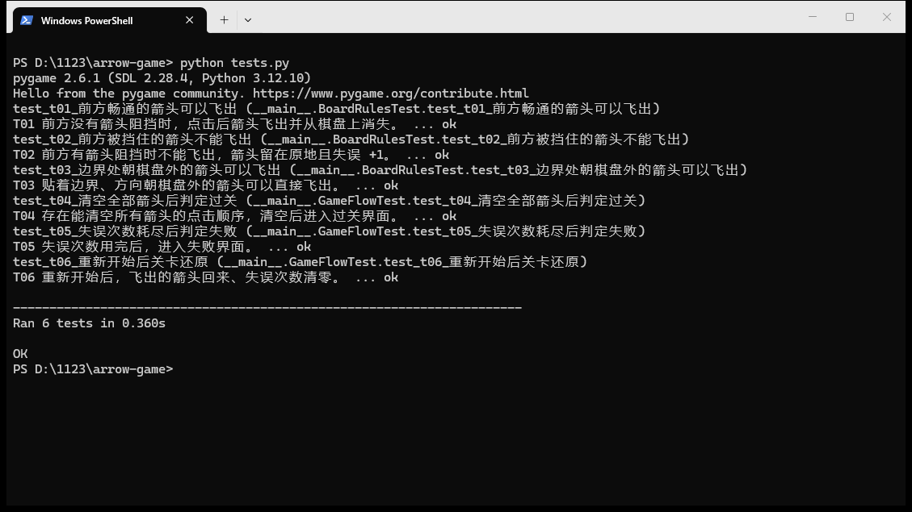
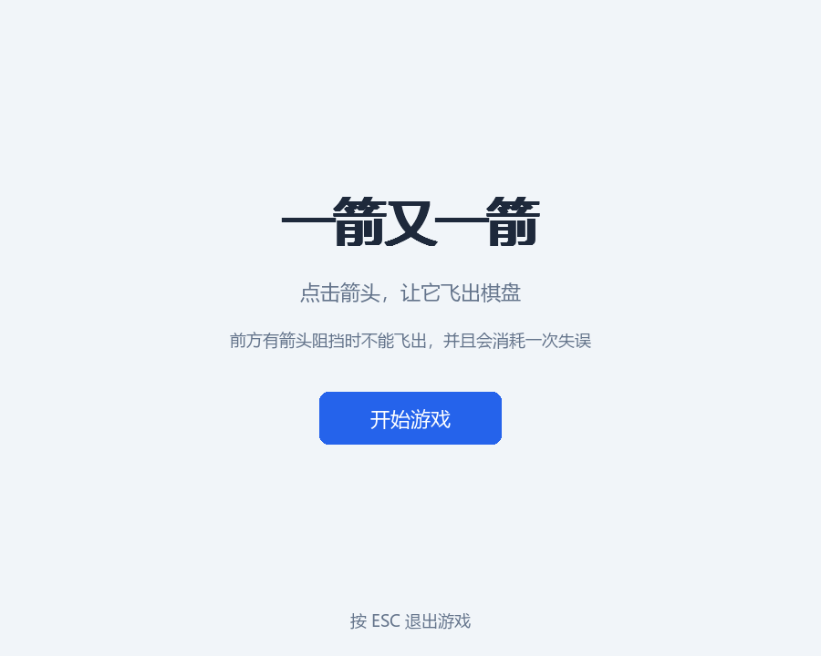
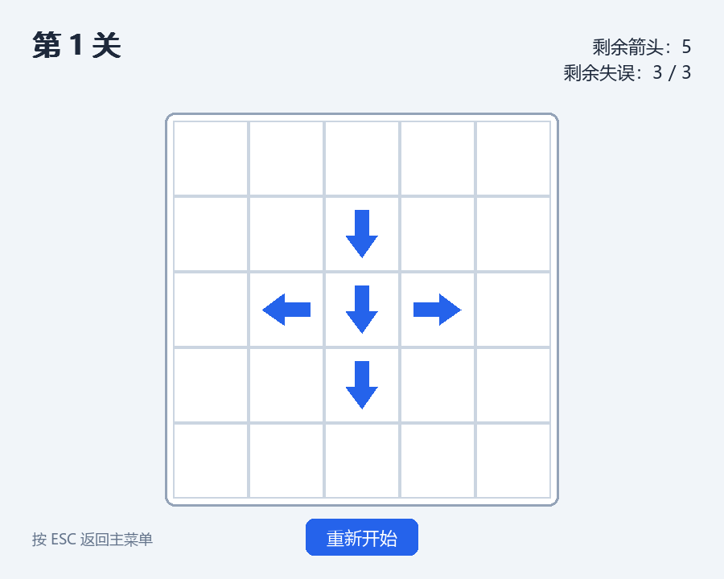
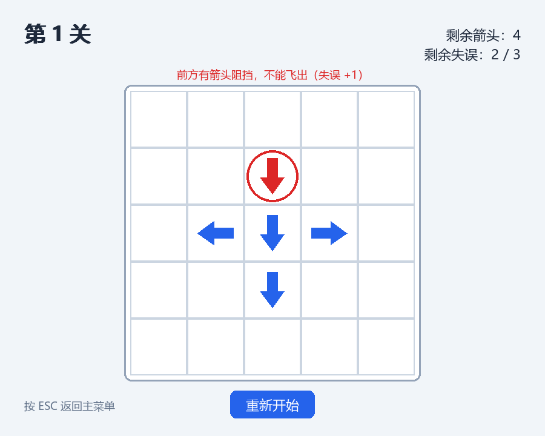
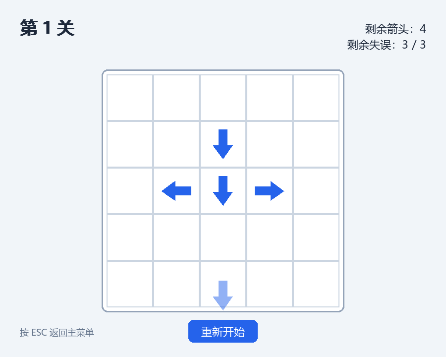
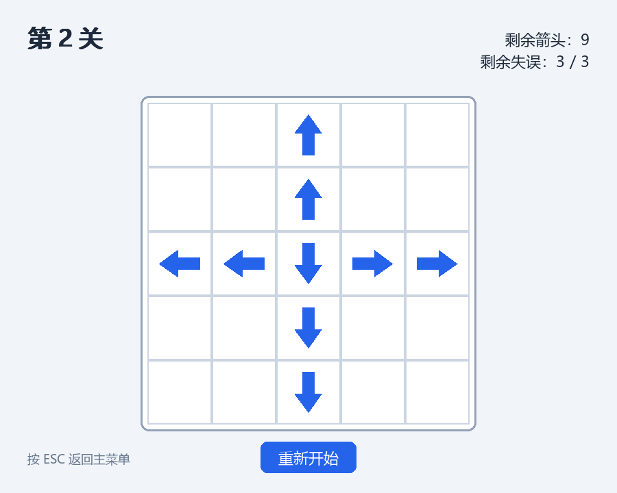
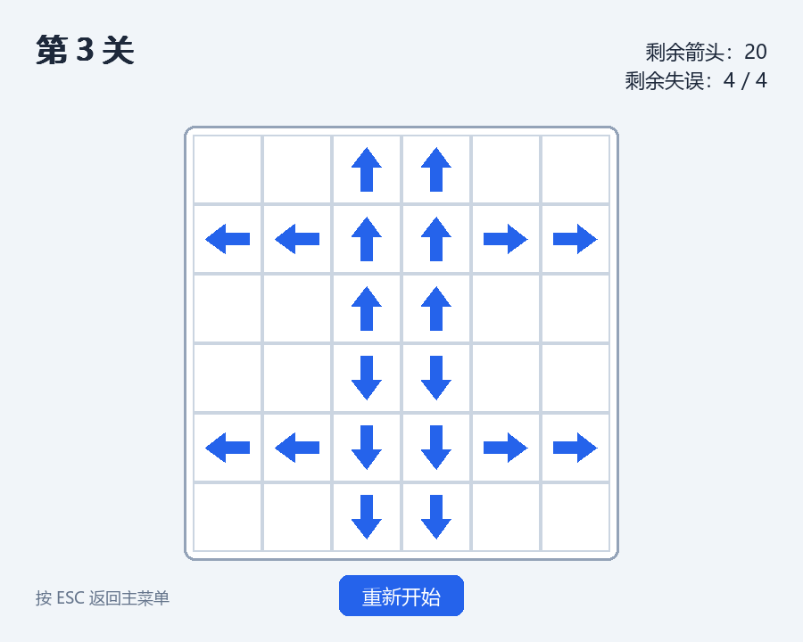
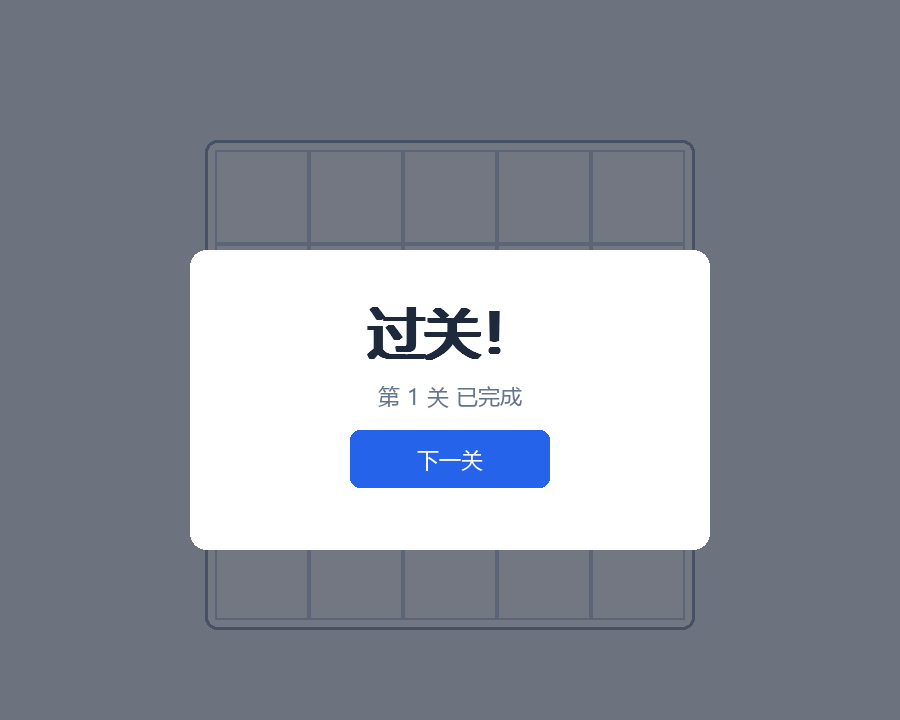
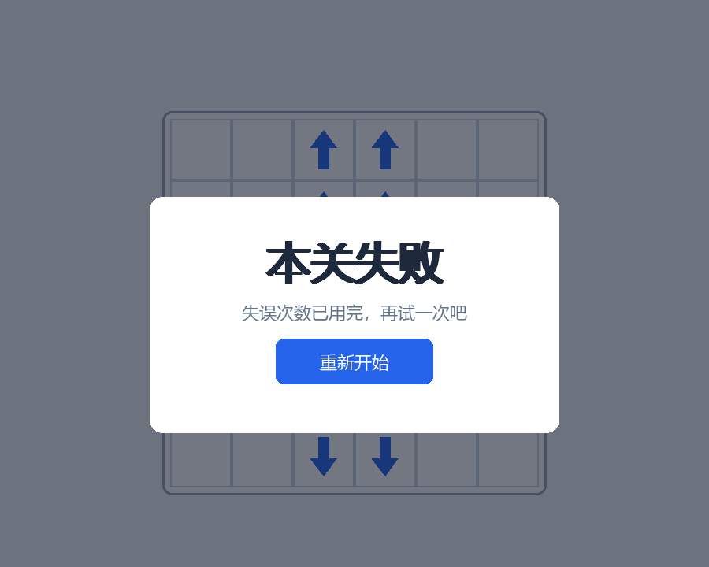

# 一箭又一箭（Arrow After Arrow）

一个用 Python + pygame 编写的点击式箭头解谜小游戏。

棋盘上摆着不同方向的箭头，点击一支箭头时：

- 如果它到棋盘边界之间没有其他箭头阻挡，它就会沿自己的方向飞出棋盘并被消除；
- 如果前方被别的箭头挡住，这支箭头不能飞出，本次点击算一次失误；
- 失误次数用完则本关失败；把一关的箭头全部清空即可过关。

## 开发环境

- 操作系统：Windows 10 / 11
- 语言：Python 3.12
- 图形库：pygame 2.6.1（见 `requirements.txt`）

## 安装与运行

### 方式一：免安装可执行文件（Windows）

从 [Releases](https://github.com/otonash1/arrow-game/releases/latest) 下载 `ArrowGame.exe`，双击即可运行，不需要安装 Python 和 pygame。

### 方式二：从源码运行

```bash
pip install -r requirements.txt
python main.py
```

如果想自己打包成单文件 exe：

```bash
pyinstaller --onefile --windowed --name ArrowGame main.py
```

## 操作说明

- 开始界面：点击「开始游戏」进入第 1 关。
- 游戏中：鼠标左键点击棋盘上的箭头。
  - 前方畅通 → 箭头飞出棋盘并从棋盘上消失；
  - 前方有箭头阻挡 → 不能飞出，失误次数 +1，箭头会抖动一下并显示提示文字。
- 游戏界面顶部显示当前关卡名、剩余箭头数、剩余失误次数。
- 「重新开始」按钮：把当前关卡恢复成初始状态（飞出的箭头回来、失误清零）。
- 过关后点「下一关」继续；失误耗尽后点「重新开始」重试本关。
- 键盘 ESC：在游戏中返回主菜单，在开始界面退出游戏。

## 关卡设计

关卡数据写在 `levels.py` 中，用字符矩阵描述：`.` 表示空格子，`^` `v` `<` `>` 表示四个方向的箭头。

| 关卡 | 棋盘大小 | 箭头数量 | 失误上限 |
| --- | --- | --- | --- |
| 第 1 关 | 5 × 5 | 5 | 3 |
| 第 2 关 | 5 × 5 | 9 | 3 |
| 第 3 关 | 6 × 6 | 20 | 4 |

三关都存在能把所有箭头清空的点击顺序，整体难度循序渐进。

## 项目结构

```
main.py       程序入口：初始化 pygame，进入主循环
config.py     全局配置：窗口尺寸、配色、字体、按钮位置等常量
levels.py     关卡数据（字符矩阵）
board.py      棋盘与规则逻辑（不依赖 pygame，可单独测试）
game.py       游戏状态机：场景切换、事件分发、动画推进
renderer.py   绘制层：棋盘、箭头、按钮和各界面
tests.py      T01–T06 自动化测试
screenshots/  界面截图
```

## 测试

在项目目录下运行：

```bash
python tests.py
```

测试覆盖下列六项内容（使用 pygame 的 dummy 视频驱动，不需要真实显示器）：

| 编号 | 测试内容 | 结果 |
| --- | --- | --- |
| T01 | 前方畅通的箭头点击后飞出并消除 | 通过 |
| T02 | 前方被挡住的箭头不能飞出且失误 +1 | 通过 |
| T03 | 边界处朝棋盘外的箭头可以飞出 | 通过 |
| T04 | 清空全部箭头后判定过关（三个关卡均可清空） | 通过 |
| T05 | 失误次数耗尽后判定失败 | 通过 |
| T06 | 重新开始后箭头布局与失误次数还原 | 通过 |

实际运行输出：

```text
PS D:\1123\arrow-game> python tests.py
pygame 2.6.1 (SDL 2.28.4, Python 3.12.10)
Hello from the pygame community. https://www.pygame.org/contribute.html
test_t01_前方畅通的箭头可以飞出 (__main__.BoardRulesTest.test_t01_前方畅通的箭头可以飞出)
T01 前方没有箭头阻挡时，点击后箭头飞出并从棋盘上消失。 ... ok
test_t02_前方被挡住的箭头不能飞出 (__main__.BoardRulesTest.test_t02_前方被挡住的箭头不能飞出)
T02 前方有箭头阻挡时不能飞出，箭头留在原地且失误 +1。 ... ok
test_t03_边界处朝棋盘外的箭头可以飞出 (__main__.BoardRulesTest.test_t03_边界处朝棋盘外的箭头可以飞出)
T03 贴着边界、方向朝棋盘外的箭头可以直接飞出。 ... ok
test_t04_清空全部箭头后判定过关 (__main__.GameFlowTest.test_t04_清空全部箭头后判定过关)
T04 存在能清空所有箭头的点击顺序，清空后进入过关界面。 ... ok
test_t05_失误次数耗尽后判定失败 (__main__.GameFlowTest.test_t05_失误次数耗尽后判定失败)
T05 失误次数用完，进入失败界面。 ... ok
test_t06_重新开始后关卡还原 (__main__.GameFlowTest.test_t06_重新开始后关卡还原)
T06 重新开始后，飞出的箭头回来、失误次数清零。 ... ok

----------------------------------------------------------------------
Ran 6 tests in 0.360s

OK
```

对应的运行截图：



## 截图

开始界面：



第 1 关：



点击前方被挡住的箭头，提示失误 +1：



箭头飞出的动画：



第 2 关：



第 3 关：



过关界面：



失败界面：



全部通关界面：

